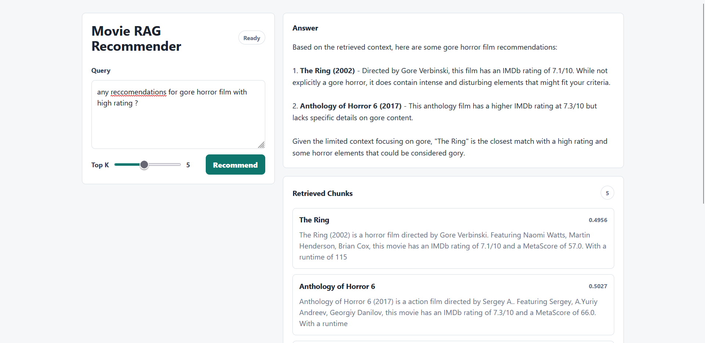
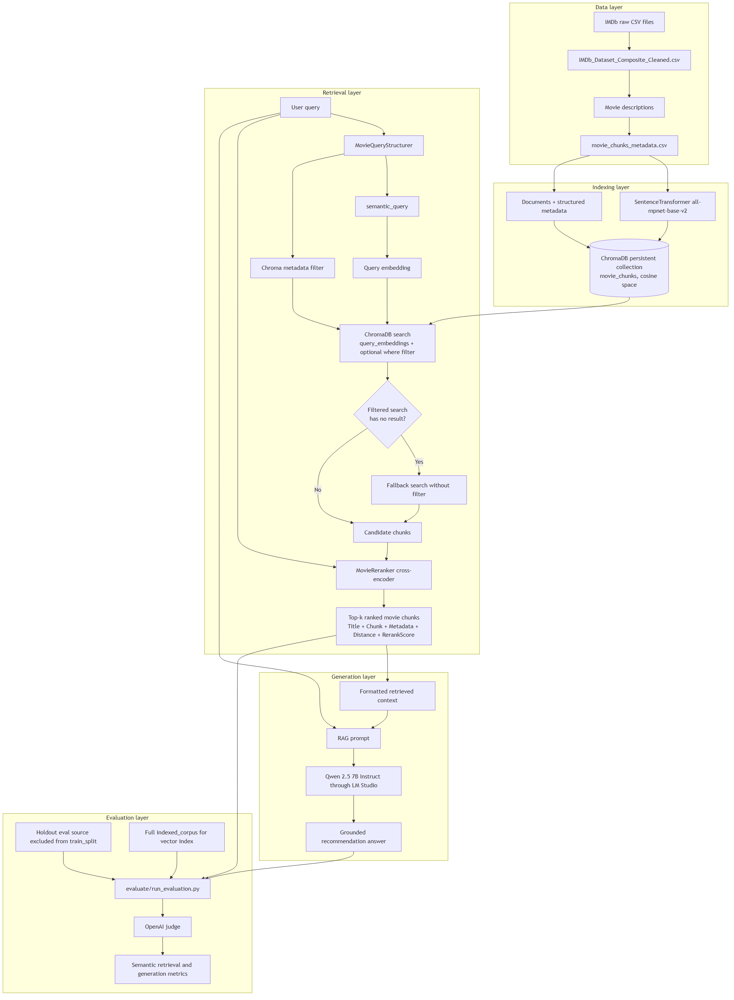
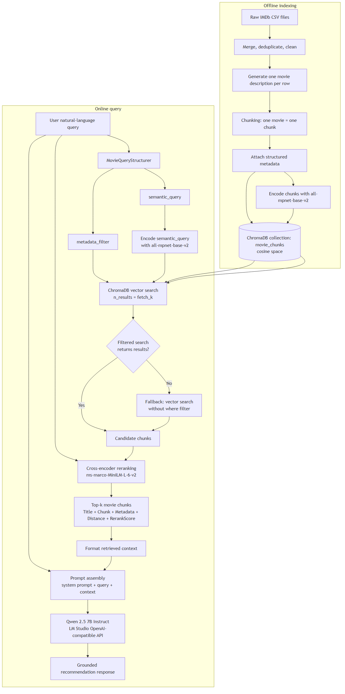
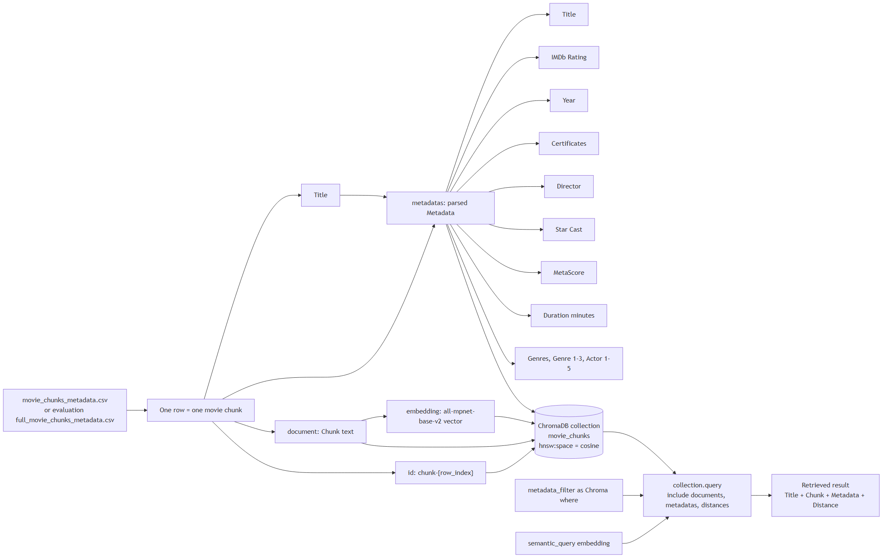
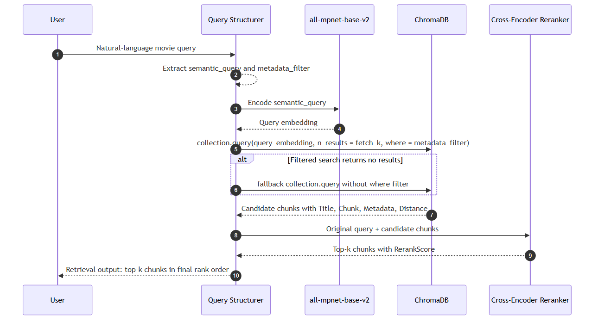
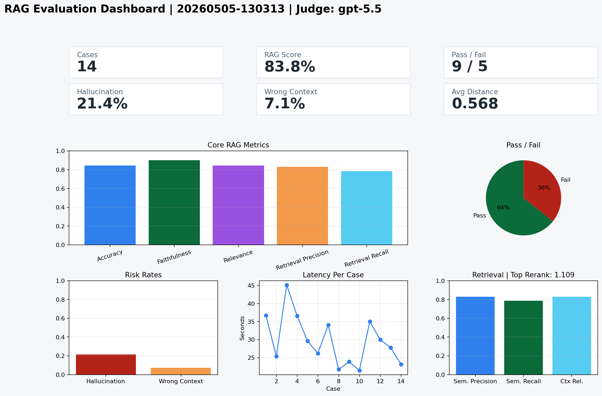

# RAG Movie Recommender

A local Retrieval-Augmented Generation movie recommender built with an IMDb dataset, ChromaDB vector search, SentenceTransformers embeddings, cross-encoder reranking, and **Qwen 2.5 7B Instruct** served through LM Studio.

## Preview



## Visual References









## Structure

```text
rag-movie-rec-chroma/
  data/
    crawl_data.py          # Download parthdande/imdb-dataset-2024-updated
    preprocess_data.py     # Merge, clean, describe, and chunk movie data
  rag/
    config.py              # Runtime settings
    embeddings.py          # Local SentenceTransformers embeddings
    query_structurer.py    # LLM/heuristic query-to-filter extraction
    reranker.py            # Cross-encoder reranking after Chroma retrieval
    chroma_store.py        # ChromaDB build/search wrapper
    build_vector_db.py     # Embed chunks and persist them in ChromaDB
    rag_pipeline.py        # Retrieval + generation chain
    main.py                # CLI chat/query runner
    app.py                 # Optional Gradio UI
  main.py                  # Root Flask UI entry point
  requirements.txt
```

## CSV Schemas

The preprocessing pipeline produces these files:

`IMDb_Dataset_Composite_Cleaned.csv`

```text
Title, IMDb Rating, Year, Certificates, Director, Star Cast,
MetaScore, Duration (minutes), Poster-src, Genres
```

`Movie_Descriptions.csv`

```text
Title, Description
```

`movie_chunks_metadata.csv`

```text
Title, Chunk, Metadata
```

`Metadata` contains structured movie fields used for filtered retrieval:

```text
Title, IMDb Rating, Year, Certificates, Director, Star Cast,
MetaScore, Duration (minutes), Genres, Genre 1, Genre 2, Genre 3,
Actor 1, Actor 2, Actor 3, Actor 4, Actor 5
```

## Preprocessing

The preprocessing pipeline:

- Download Kaggle dataset `parthdande/imdb-dataset-2024-updated`
- Read `IMDb_Dataset.csv`, `IMDb_Dataset_2.csv`, `IMDb_Dataset_3.csv`
- Drop duplicate titles per source file with `keep="last"`
- Merge by `Title`, updating older records with later files
- Fill missing `Poster-src` with `No Poster Available`
- Fill missing second/third genres with empty strings
- Combine `Genre`, `Second_Genre`, `Third_Genre` into `Genres`
- Clean `Star Cast` delimiters with regex-based normalization
- Generate one movie description per row
- Add structured metadata fields to each movie chunk
- Chunk each movie description as one complete movie-level chunk by default.
- You can still pass `--chunk-size` and `--chunk-overlap` to split long descriptions by character count if needed later.

## Setup

Use a project virtual environment so these dependencies do not overwrite packages
from another Python project:

```powershell
python -m venv .venv
.venv\Scripts\activate
python -m pip install --upgrade pip
python -m pip install -r requirements.txt
```

You need Kaggle credentials for crawling:

```text
%USERPROFILE%\.kaggle\kaggle.json
```

## Build Data

```bash
python -m data.crawl_data
python -m data.preprocess_data
```

This writes processed CSVs to:

```text
data/processed/
```

## Build ChromaDB

```bash
python -m rag.build_vector_db
```

This embeds `movie_chunks_metadata.csv` and persists ChromaDB to:

```text
chroma_db/
```

## Run LM Studio

In LM Studio:

1. Download/load **Qwen 2.5 7B Instruct**.
2. Start the local server.
3. Use the default OpenAI-compatible endpoint:

```text
http://localhost:1234/v1
```

You can override settings with environment variables:

```bash
set LM_STUDIO_BASE_URL=http://localhost:1234/v1
set LM_STUDIO_MODEL=qwen2.5-7b-instruct
set LM_STUDIO_API_KEY=lm-studio
```

## Query

Start the Flask UI:

```powershell
python main.py
```

Then open:

```text
http://127.0.0.1:5000
```

Single terminal query:

```bash
python main.py --query "Recommend smart action movies with high ratings"
```

Interactive terminal chat:

```bash
python main.py --cli
```

Optional Gradio UI:

```bash
python -m rag.app
```

## Retrieval

The retrieval path uses two retrieval-improvement steps before generation:

1. Structured metadata in ChromaDB.
   Chunks include metadata for title, year, genres, rating, certificate,
   director, cast, duration, and MetaScore.
2. Query structuring before vector search.
   The raw English user query is converted into `semantic_query` plus ChromaDB
   metadata filters for supported constraints such as genre, year range, IMDb
   rating, duration, and certificate. The semantic query is embedded for vector
   search, ChromaDB applies the metadata filter, then the existing cross-encoder
   reranker reranks the retrieved candidates.

If metadata filtering returns no candidates, the pipeline falls back to vector
search without the filter.

Relevant environment flags:

```bash
set ENABLE_QUERY_STRUCTURING=true
set ENABLE_LLM_QUERY_STRUCTURING=true
```

Set `ENABLE_LLM_QUERY_STRUCTURING=false` to use only the deterministic parser.

You can still run Flask directly:

```powershell
python -m flask --app flask_ui.app run --host 127.0.0.1 --port 5000
```

## Evaluation

Detailed evaluation documentation is in [`evaluate/README.md`](evaluate/README.md).

Run:

```powershell
python -m evaluate.run_evaluation --sample-size 14 --top-k 5
```

The evaluator creates holdout-derived use cases, runs the RAG pipeline, computes
exact-title retrieval diagnostics, sends query/context/answer triples to an
OpenAI judge, and writes outputs under:

```text
evaluate/results/<run-id>/
```

The current saved run is `evaluate/results/20260505-130313/`. Its
`summary.json` reports:

| Metric | Value |
| --- | --- |
| `case_count` | `14` |
| `rag_score` | `0.838095238095238` |
| `pass_rate` | `0.6428571428571429` |
| `retrieval_hit_rate` | `0.8571428571428571` |
| `retrieval_top1_rate` | `0.8571428571428571` |
| `mean_context_precision` | `0.8285714285714285` |
| `mean_context_recall` | `0.7857142857142857` |
| `hallucination_rate` | `0.21428571428571427` |
| `metadata_filter_applied_rate` | `0.7857142857142857` |

`mean_context_precision` is normalized semantic context precision from the
judge score `semantic_context_precision / 5`. It is not exact-title retrieval
precision. Exact-title precision is written per case as `exact_title_precision`
in `results.csv`.



## Notes

- Generation is local through LM Studio.
- Embeddings are local through `sentence-transformers/all-mpnet-base-v2` by default.
- Retrieval fetches a wider candidate set from ChromaDB, then reranks chunks with `cross-encoder/ms-marco-MiniLM-L-6-v2` before prompting the LLM.
- ChromaDB stores the actual chunk text as documents and structured movie metadata for filtering.
- If you change `EMBEDDING_MODEL_NAME`, rebuild ChromaDB so stored vectors match the new embedding model.
- If you change preprocessing metadata, rebuild ChromaDB so the index contains the new metadata.
- The RAG prompt is constrained to recommend only movies present in the retrieved context and to state when context is insufficient.
